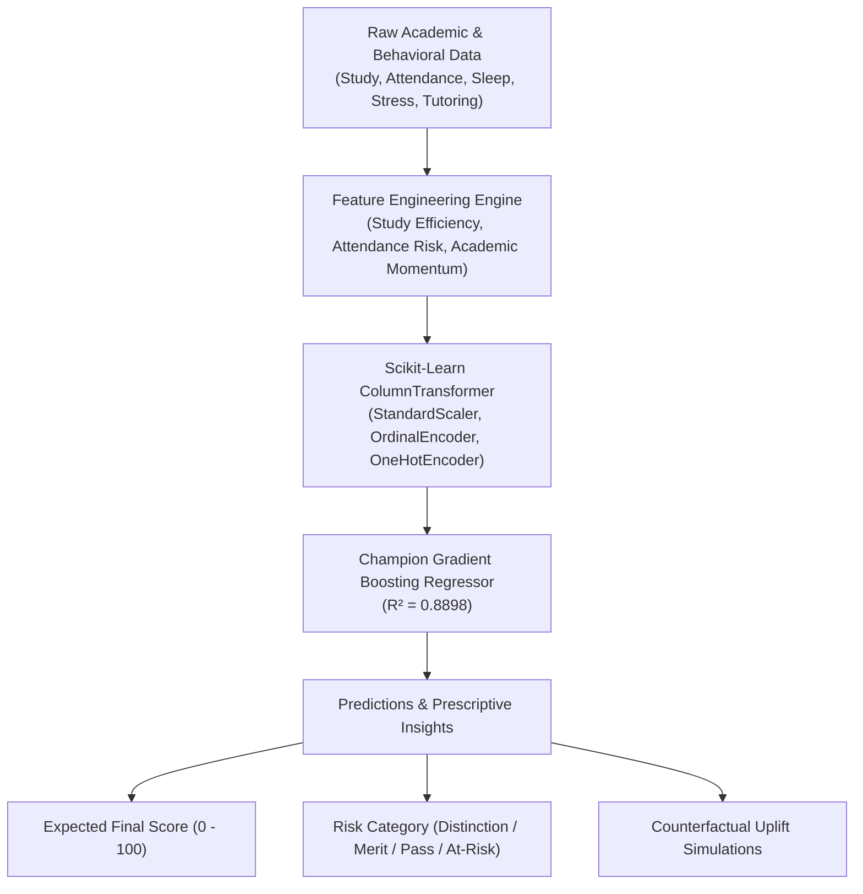

# 🎓 Student Academic Performance Prediction Engine

> 🚀 **Live Web App:** **[https://student-performance-predictor-88bc.onrender.com](https://student-performance-predictor-88bc.onrender.com)**

[](https://student-performance-predictor-88bc.onrender.com)

[](#)
[](#)
[](#)
[](#)
[](#)
[](#)
[](LICENSE)

An end-to-end Machine Learning intelligence engine that predicts student final exam performance, categorizes academic risk tiers, identifies individual behavioral friction points, and computes counterfactual "what-if" prescriptive improvement recommendations.

---

## 🌟 Key Features

* **🧠 Multi-Model Benchmarking:** Evaluates Random Forest, Gradient Boosting, Ridge Regression, Support Vector Regressors (SVR), and Ordinary Least Squares using 5-fold cross-validation.
* **🔬 Domain-Specific Feature Engineering:**
  * **Study Efficiency Ratio:** Ratio of self-study investment to cognitive rest baseline.
  * **Attendance Risk Penalty:** Discontinuous penalty factor for attendance dipping below the 75% threshold.
  * **Academic Momentum:** Prior semester performance amplified by tutoring interventions.
  * **Wellbeing Balance Index:** Ratio of sleep hours to subjective stress levels.
* **📊 Visual Analytics Suite:** Generates 5 publication-ready charts using **Matplotlib** and **Seaborn**:
  * Correlation Matrix Heatmap
  * Actual vs. Predicted Regression Scatter
  * Feature Importance Rankings (Gini / MDI)
  * Residual Error Normality Distribution
  * Academic Performance Tiers Boxplots
* **🎯 Prescriptive Recommendation Engine:** Simulates personalized score uplifts (e.g., *"Increasing study hours from 8h to 14h yields a projected +6.2 score increase"*).
* **🖥️ Interactive Local Dashboard:** Clean web interface with real-time sliders, instant inference, and visual analytics gallery.

---

## 🏆 Model Benchmark Leaderboard

Evaluated on an out-of-sample holdout test set (500 samples, 20%):

| Model | 5-Fold CV $R^2$ | Test $R^2$ | RMSE | MAE | Status |
| :--- | :---: | :---: | :---: | :---: | :---: |
| **Gradient Boosting Regressor** | **0.8565 (±0.008)** | **0.8898** | **3.360** | **2.538** | 🏆 **Champion** |
| **Support Vector Regressor (SVR)** | 0.8495 (±0.006) | 0.8732 | 3.604 | 2.657 | Runner-Up |
| **Random Forest Regressor** | 0.7944 (±0.009) | 0.8316 | 4.153 | 2.987 | Strong Non-Linear |
| **Ridge Regression** | 0.7355 (±0.016) | 0.7566 | 4.993 | 3.820 | Linear Regularized |
| **Linear Regression** | 0.7355 (±0.017) | 0.7566 | 4.993 | 3.817 | Baseline |

---

## 🏗️ Architecture & Pipeline



---

## 📂 Project Structure

```text
student-performance-predictor/
├── requirements.txt         # Dependencies (numpy, pandas, scikit-learn, matplotlib, seaborn)
├── .gitignore               # Ignored environments and caches
├── README.md                # Project documentation
├── data/
│   ├── raw/
│   │   └── student_data.csv # 2,500 student behavioral records
│   └── processed/
├── models/
│   ├── student_performance_model.joblib # Champion Gradient Boosting model
│   ├── preprocessor.joblib              # Fitted ColumnTransformer
│   └── model_metadata.json              # Benchmark metrics and feature rankings
├── artifacts/
│   └── visualizations/
│       ├── correlation_heatmap.png      # Seaborn correlation matrix
│       ├── actual_vs_predicted.png      # Regression fit plot
│       ├── feature_importance.png       # Gini importance bar chart
│       ├── residuals_distribution.png   # Error normality histogram
│       └── academic_tiers_distribution.png # Boxplots across performance tiers
├── src/
│   ├── data_generator.py     # Synthetic data generation with educational logic
│   ├── data_preprocessing.py # Feature engineering & ColumnTransformer
│   ├── train.py              # Model benchmarking, CV, and model serialization
│   ├── evaluate.py           # Matplotlib & Seaborn visual analytics suite
│   ├── predict.py            # Prescriptive inference & recommendation engine
│   └── app.py                # Interactive web dashboard & HTTP server
└── tests/
    └── test_pipeline.py      # Automated unit tests
```

---

## 🚀 Quick Start Guide

### 1. Activate the Virtual Environment
From the project folder:
```powershell
cd C:\Users\ayush\.gemini\antigravity\scratch\student-performance-predictor
.\venv\Scripts\Activate.ps1
```

### 2. Run the Interactive Web Dashboard
Launch the dashboard to interact with sliders and view real-time score updates and visualizations:
```powershell
python src\app.py
```
Open **[http://localhost:8000](http://localhost:8000)** in your browser!

### 3. Run Individual Pipeline Stages

* **Re-train & Benchmark Models:**
  ```powershell
  python src\train.py
  ```
* **Generate Fresh Seaborn / Matplotlib Visualizations:**
  ```powershell
  python src\evaluate.py
  ```
* **Run CLI Single-Student Prediction:**
  ```powershell
  python src\predict.py
  ```
* **Execute Unit Tests:**
  ```powershell
  python -m unittest discover -s tests -p "test_*.py"
  ```

---

## 📊 Sample Inference Output

```text
--- Student Academic Performance Prediction ---
Predicted Final Exam Score: 74.5/100
Academic Tier: [Good] Good Standing (Merit)
Risk Level: Low

Risk Factors:
 - Sub-optimal attendance (72.0%): Falling below 75% triggers significant academic penalties.
 - Sleep deprivation (5.5 hours/night) impairs memory consolidation.
 - High subjective stress level (8/10) degrades exam retention.

Actionable Uplift Simulations:
 -> Increase weekly study by +6 hours (to 16.5h): 78.4 (+3.9 pts)
 -> Increase class attendance to 95%: 85.3 (+10.8 pts)
 -> Attend 2 additional tutoring sessions/month: 79.5 (+5.0 pts)
```

---

## 📄 License
MIT License. Built by Ayush.
